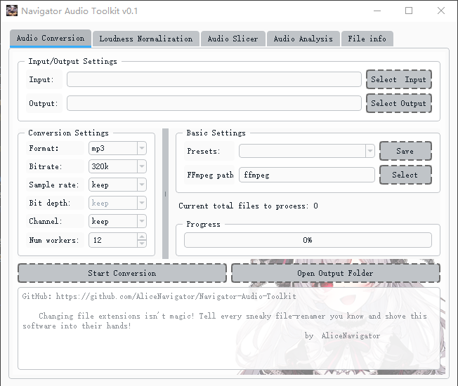
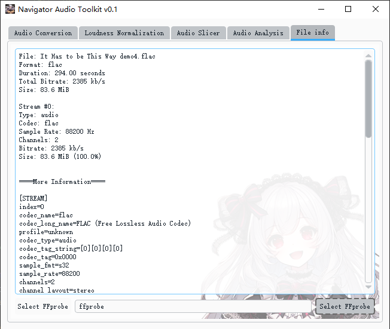
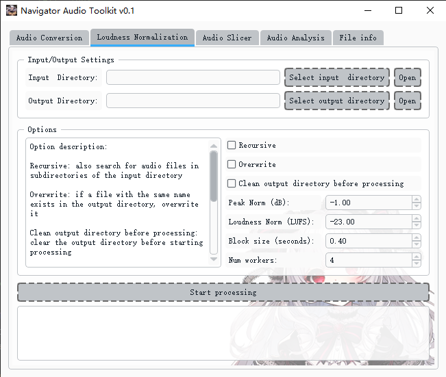
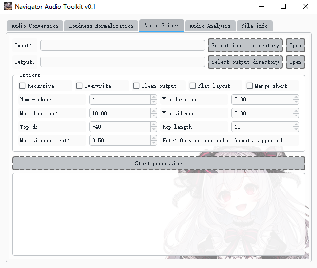
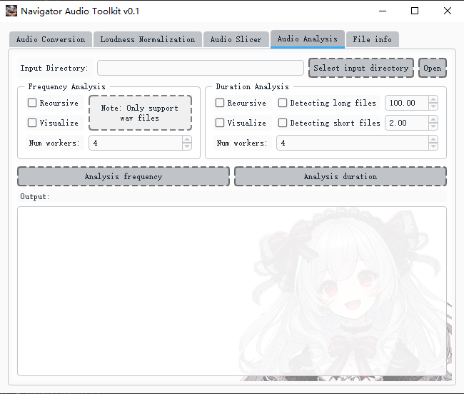
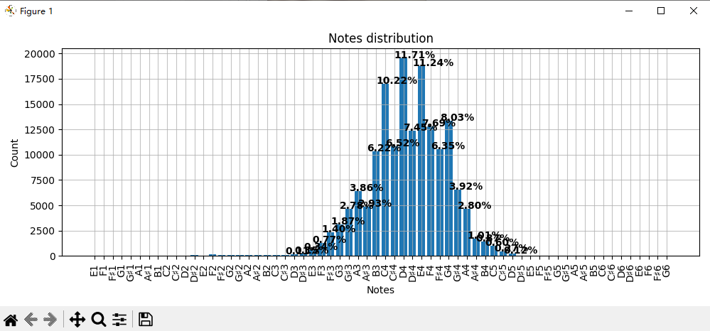

# Navigator Audio Toolkit

Navigator Audio Toolkit is a comprehensive, all-in-one audio dataset processing tool that integrates audio format conversion, loudness normalization, audio slicing, audio dataset analysis, and media information analysis.

## Introduction

<p float="left">
  
  
</p>

**注意： 如果你的系统语言为中文，那么界面语言应该会自动切换为中文**

You can specify the FFmpeg and FFprobe executables to use, or utilize the built-in versions (if you choose the standalone version). To conveniently view detailed information about media files, simply drag them into the file information page.

<p float="left">
  
  
</p>

The toolkit offers loudness normalization and audio slicing functionalities, as demonstrated in the images above.

<p float="left">
  
  
</p>

This analysis page allows you to quickly examine the pitch distribution and audio slice duration distribution within your dataset, helping you assess the quality of your dataset.

## Usage

You can download the latest release directly from [here](https://github.com/AliceNavigator/Navigator-Audio-Toolkit/releases/latest).

## Installation

1. Install FFmpeg and ensure it's in your system PATH.
2. Clone this repository:
   ```
   git clone https://github.com/AliceNavigator/Navigator-Audio-Toolkit.git
   ```
3. Install dependencies:
   ```
   pip install -r requirements.txt
   ```
4. Execute:
   ```
   python navigator_audio_toolkit.py
   ```
